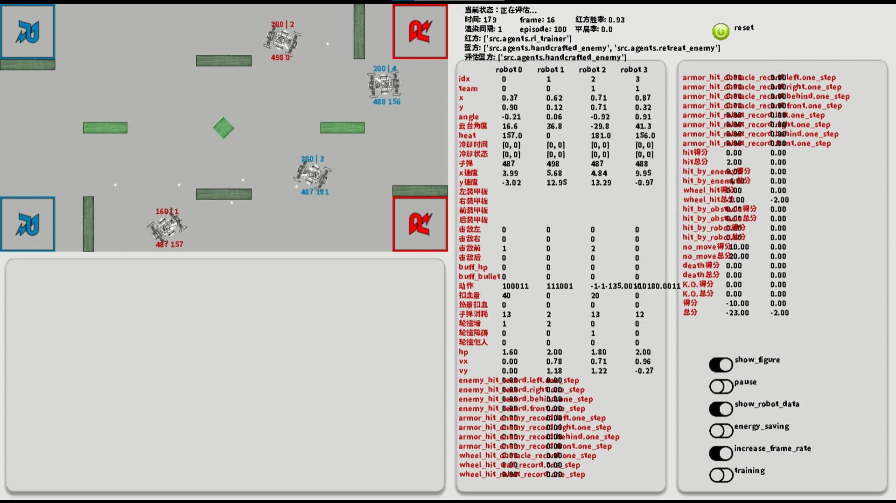

# Robomaster AI Challenge仿真环境

视频演示：
https://m.bilibili.com/video/BV1Xe411N7rC

# 支持PPO+LSTM+1D卷积训练，针对行为树+A*算法构建的进攻型对手胜率可达92%

参考论文：[Multi-Robot Real-time Game Strategy Learning based on Deep Reinforcement Learning](https://ieeexplore.ieee.org/abstract/document/10011827)
（注论文发表时效果还没有那么好，所以论文中的效果不如目前项目的效果）

## 强化学习部分
- 奖励：
  - TODO：增加与障碍物碰撞的惩罚
- TODO: update obs space(such as velocity)
- actor网络最后一层权重用小std正交初始化
- 改relu为tanh后效果反变差
- entropy loss暂时去掉
- LSTM比GRU效果明显更好

## 环境部分
- 新增障碍物类型。场地中有两种不同高度的障碍物，较矮的障碍物只能阻挡机器人前进不能阻挡子弹，标记为1,其他的标记为0
- 进入robomaster2D, 使用指令"pip install -e ."就可以安装环境;运行./robomaster2D/robomaster2D/envs文件夹下的RMUA_Env_for_RL.py文件即可手动控制机器人来测试环境
- 防止打死队友：瞄准敌人之后才允许射击（action mask）
- 解决bug：如果子弹同时穿过障碍物与机器人，就会判定子弹撞上机器人，没有先后
  - 解决办法：在有障碍物的情况下，将子弹轨迹分成多段判断
- 尚存bug：某个或多个打击源同时致死时，可能导致伤害溢出，这样计算出来的分别的伤害值是不准确的
## 评估部分
- 已解决：当前胜率为环境内置的前100场胜率，应改为实时胜率
- 评估进程可能是内存溢出的元凶;长期训练应不采用评估进程
- 
### 对障碍物进行建模
- 构建含障碍物的局部地图
- critic和actor网络共享CNN主干
### 构建行为树
- handcrafted enemy可以基于Astar路径规划模块对我方进行分别跟踪打击

## 与神经网络控制的敌人对抗训练部分
- 敌人模型有两种模式：
  - 与自己的模型同步（优先级：1）
    - 可调节同步间隔
  - 读取固定策略模型（优先级：2）
- 评估进程敌人的策略模式：
  - 固定策略：只读取一次模型，敌人策略网络无需共享内存
  - 变化策略
- 评估进程是否创建敌人模型，取决于是否给定敌人策略的路径或是否self play
## 多进程运行环境部分
- 多进程方面如果某个管道堆积太多消息可能会导致cpu内存爆炸
- 会开一个监视进程，负责记录主进程发送了几次消息给评估进程，作为共享变量交给评估进程利用，评估进程就可以做相应次数的接收来获取最新消息
- 多进程环境无法开启pygame渲染，因为fork不支持pygame.font
## 可视化部分
- 环境的参数中可配置是否渲染环境界面。
  - 若配置为render=True，则在调用环境时可通过env.render等函数来开启渲染等功能;
  - 若配置为render=False，则调用env.render等函数无法开启渲染等功能
- 为了使得渲染画面更流畅，并能够自由指定渲染帧率，RMUA_Env_for_RL中的env.render函数只是用来开启渲染。开启渲染后，各个模块中的render_inited属性将被激活，从而进行对应的UI显示操作
- RMUA_Env_for_RL中的display_character函数可以指定一串字符串进行显示，多种模式开发中
